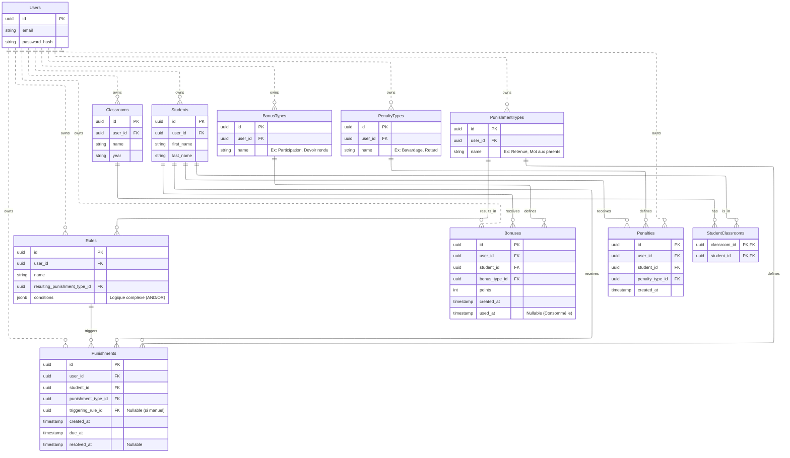

# Projet The Punisher - Documentation

## 1. Objectif & Vision

**The Punisher** est une plateforme de gestion disciplinaire pour établissements scolaires (ou professeurs indépendants). Elle permet de suivre le comportement des élèves via un système double :
- **Renforcement positif** : Attribution de points bonus, badges, etc.
- **Suivi des incidents** : Enregistrement des manquements (oublis, bavardages) et application automatique de sanctions.

L'objectif est d'automatiser la "comptabilité" disciplinaire pour libérer du temps pédagogique et garantir une équité dans l'application des règles.

## 2. Fonctionnalités Clés

### Gestion des Acteurs
- **Professeur (User)** : Propriétaire de ses données. Configure ses classes, ses élèves et ses propres règles.
- **Élève (Student)** : Appartient à une ou plusieurs classes. Bénéficiaire des points/sanctions.

### Système de Points
- **Bonus** : Points positifs (ex: "Participation active", "Devoir rendu en avance").
    - **Cycle de vie** : Un bonus est attribué (`created_at`) puis peut être consommé (`used_at`) pour obtenir un avantage (ex: +0.5 sur une note).
- **Malus / Oublis (Penalty)** : Incidents négatifs (ex: "Oubli de matériel", "Retard"). **Note :** Les bonus n'annulent pas les malus. Ce sont deux compteurs distincts.

### Système de Punitions & Règles (Automobile)
- **Punition (Punishment)** : Sanction à effectuer (ex: "Retenue", "Copie de lignes"). Possède un cycle de vie (`pending` -> `resolved`).
- **Règles Automatiques (Rules)** :
    - Le cœur du système.
    - Permet de définir des déclencheurs complexes via une structure **JSON**.
    - *Exemple* : "SI (3 Oublis Matériel) OU (2 Bavardages + 1 Insolence) ALORS (1h de Retenue)".
    - **Périodicité** : Aucune remise à zéro automatique des compteurs (choix utilisateur).

## 3. Modèle de Données (Schema)

Le schéma est conçu pour être multi-tenant (chaque ressource appartient à un `user_id`). L'ajout du `user_id` sur les tables d'événements facilite les requêtes globales par professeur.

### Diagramme Entité-Relation (Mermaid)



### Détail des Tables Clés

#### `rules` (Règles Automatiques)
Cette table stocke la logique de déclenchement.
- `conditions` (JSONB) : Stocke l'arbre logique.
  ```json
  {
    "operator": "OR",
    "triggers": [
      {
        "type": "penalty_count",
        "penalty_type_id": "uuid-oubli-materiel",
        "threshold": 3
      },
      {
        "operator": "AND",
        "triggers": [
           { "type": "penalty_count", "penalty_type_id": "uuid-bavardage", "threshold": 2 },
           { "type": "penalty_count", "penalty_type_id": "uuid-insolence", "threshold": 1 }
        ]
      }
    ]
  }
  ```

#### `punishments` (Punitions)
- `resolved_at` : Si `NULL`, la punition est à faire. Si rempli, elle est faite.
- `triggering_rule_id` : Permet de tracer *pourquoi* la punition a été donnée (quel automatisme).

#### `bonuses` (Bonus)
- `used_at` : Si `NULL`, le bonus est disponible. Si rempli, il a été consommé (ex: pour remonter une note).

## 4. Règles Métier Confirmées

1. **Isolation** : Chaque professeur voit et gère uniquement ses données. Pas de partage de règles entre professeurs.
2. **Indépendance Bonus/Malus** : Un élève peut avoir 100 points de bonus et être collé 3 fois. Les points ne "rachètent" pas les fautes.
3. **Persistance** : Les compteurs d'incidents ne sont jamais remis à zéro automatiquement. C'est au professeur d'archiver ou de nettoyer s'il le souhaite.

