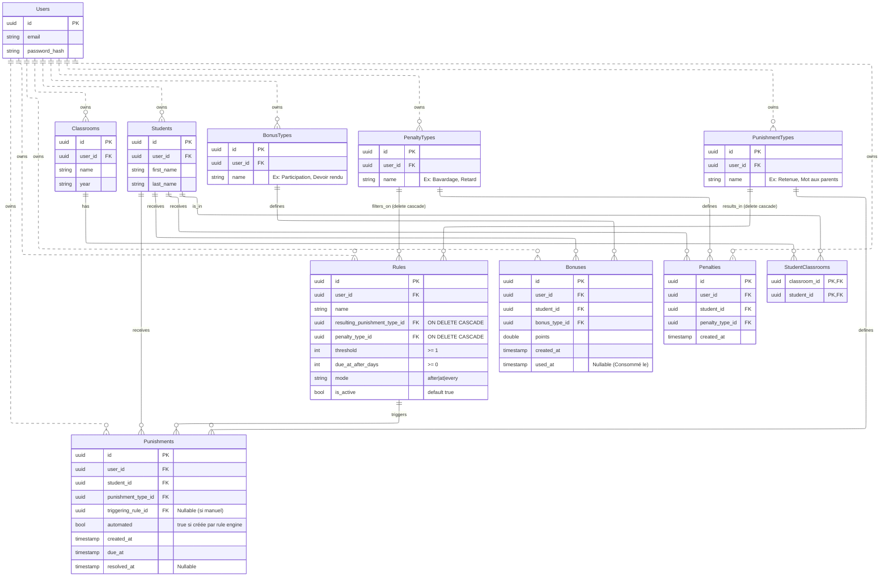

# Projet The Punisher - Référence Produit

## 1. Vision

`The Punisher` est une plateforme de gestion disciplinaire orientée classe.

Objectif:
- suivre les comportements positifs (`Bonuses`),
- suivre les incidents (`Penalties`),
- automatiser les sanctions (`Punishments`) via des règles (`Rules`),
- conserver une isolation stricte par enseignant (`user_id`).

## 2. Portée Métier

Acteurs et objets clés:
- `Users`: propriétaire des données.
- `Students`: élèves.
- `Classrooms`: classes.
- `StudentClassrooms`: relation N-N élèves/classes.
- `BonusTypes`: catalogue des bonus (ex: participation).
- `PenaltyTypes`: catalogue des incidents (ex: retard).
- `PunishmentTypes`: catalogue des sanctions (ex: retenue).
- `Bonuses`: événements positifs avec points et consommation optionnelle.
- `Penalties`: événements négatifs.
- `Rules`: logique automatique (is_active + mode + penalty_type_id + threshold + due_at_after_days -> punishment type).
- `Punishments`: sanctions manuelles ou automatiques.

## 3. Architecture de Base de Données (Canonique)

Le schéma ci-dessous est la référence à respecter.



## 4. Règles Métier

1. Isolation stricte:
- chaque requête métier est scoppée par `user_id`.
- une ressource d'un autre user est traitée comme introuvable.

2. Bonus et pénalités sont indépendants:
- les bonus ne suppriment pas les pénalités.
- les deux historiques coexistent.

3. Bonus consommables:
- `used_at = NULL` => bonus disponible.
- `used_at != NULL` => bonus consommé.

4. Pénalités cumulatives:
- `Penalties` est un journal d'événements (append-only logique).
- les règles lisent les compteurs sur cet historique.

5. Punitions manuelles et automatiques:
- manuelle: `triggering_rule_id = NULL`.
- automatique: `triggering_rule_id` référence la règle déclenchée.
- `automated` explicite l'origine de la punition (`false` manuelle / `true` automatique).

6. Cycle de vie punition:
- créée avec `created_at` et `due_at`.
- considérée en attente tant que `resolved_at IS NULL`.
- résolue quand `resolved_at` est renseigné.

7. Pas de reset automatique des compteurs:
- aucun effacement périodique implicite.
- l'enseignant pilote explicitement l'archivage/nettoyage.

8. Activation des règles:
- une règle n'est évaluée que si `is_active = true`.
- `is_active = false` désactive la règle sans la supprimer.

9. Suppression de types utilisés par les rules:
- si un `PenaltyType` est supprimé, les `Rules` liées sont supprimées automatiquement (cascade).
- si un `PunishmentType` est supprimé, les `Rules` liées sont aussi supprimées automatiquement (cascade).
- ce comportement est priorisé plutôt qu'une désactivation implicite.

## 5. Contrat des Rules

Chaque règle porte un seul trigger simple:

```json
{
  "penalty_type_id": "uuid-oubli-materiel",
  "threshold": 3,
  "due_at_after_days": 7,
  "mode": "every",
  "is_active": true
}
```

Règles d'évaluation:
- `threshold` est atteint sur l'historique des `Penalties` du même élève et du même user.
- la règle est évaluée uniquement si `is_active = true`.
- `due_at_after_days = X`: la `Punishment` auto reçoit `due_at = now + X jours`.
- `resolved_at` reste `NULL` à la création automatique.
- `mode`:
  - `at`: déclenche une fois quand `count == threshold`
  - `every`: déclenche à chaque multiple strictement positif (`count > 0 && count % threshold == 0`)
  - `after`: déclenche à chaque nouvel événement si `count > threshold`

## 6. Flux Métier de Référence

Flux automatique standard:
1. Création d'une pénalité (`Penalties`).
2. Évaluation des `Rules` actives du user.
3. Si trigger vrai: création d'une `Punishment` avec `triggering_rule_id`.
4. Suivi et résolution de la punition via `resolved_at`.

Flux bonus:
1. Création d'un bonus (`Bonuses`).
2. Consultation des bonus disponibles (`used_at IS NULL`).
3. Consommation d'un bonus (set `used_at`).

## 7. Documentation Associée

- Architecture technique: `docs/architecture.md`
- Référence API cible: `docs/api-reference.md`
- Guide implémentation feature: `docs/feature-playbook.md`
